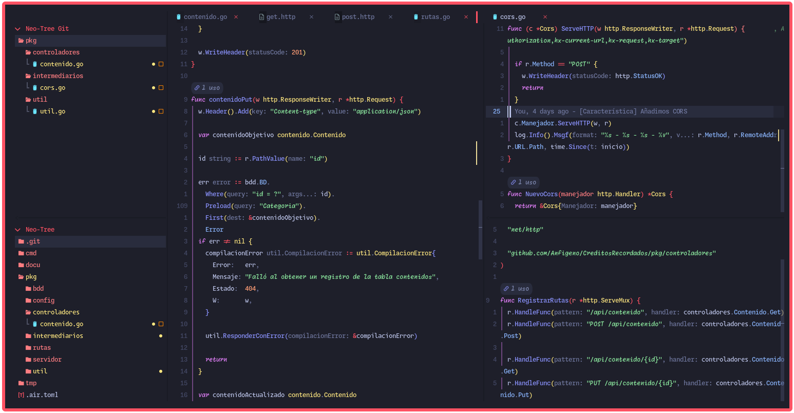
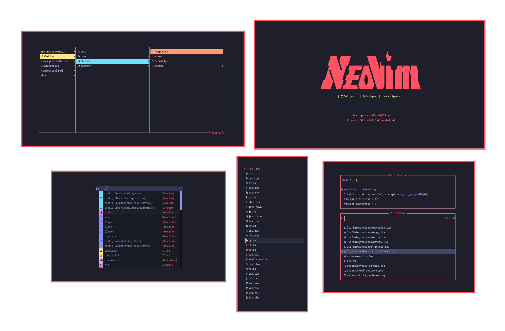

# Mestizo.nvim



Este plugin es una implementación de la paleta Mestizo para Neovim.

> [!WARNING]
> Este tema está diseñado para ser usado con diferentes tipos de fuente para cada estilo de fuente (normal, italica, negrita, italica negrita).

> [!NOTE]
> Las fuentes que ven en las capturas son:
>
> - Normal: Monaspace Neon Medium
> - Negrita: Monaspace Krypton Medium
> - Italica: Monaspace Radon Medium
> - Italica negrita: Monaspace Xenon Medium

## Instalación con `lazy.nvim`

Puedes instalar este tema simplemente con

```lua
{
    "Anfigeno/mestizo.nvim"
}
```

Luego de eso podrás usar el tema con el comando `:colorscheme mestizo` o añadiendolo a tu configuración con `vim.cmd.colorscheme("mestizo")`

## Integraciones



Mestizo.nvim tiene integraciones para los siguientes plugins:

- [bufferline.nvim](https://github.com/akinsho/bufferline.nvim)
- [nvim-cmp](https://github.com/hrsh7th/nvim-cmp)
- [dashboard-nvim](https://github.com/nvimdev/dashboard-nvim)
- [gitsigns.nvim](https://github.com/lewis6991/gitsigns.nvim)
- [nvim-navbuddy](https://github.com/SmiteshP/nvim-navbuddy)
- [neo-tree.nvim](https://github.com/nvim-neo-tree/neo-tree.nvim)
- [noice.nvim](https://github.com/folke/noice.nvim)
- [nvim-notify](https://github.com/rcarriga/nvim-notify)
- [rainbow-delimiters.nvim](https://github.com/HiPhish/rainbow-delimiters.nvim)
- [telescope.nvim](https://github.com/nvim-telescope/telescope.nvim)
- [trouble.nvim](https://github.com/folke/trouble.nvim)
- [nvim-web-devicons](https://github.com/nvim-tree/nvim-web-devicons)
- [edgy.nvim](https://github.com/folke/edgy.nvim)
- [diffview.nvim](https://github.com/sindrets/diffview.nvim)
- [lspkind.nvim](https://github.com/onsails/lspkind-nvim)
- [outline.nvim](https://github.com/hedyhli/outline.nvim)
- [markview.nvim](https://github.com/OXY2DEV/markview.nvim)

Las cuales se identifican con la siguiente lista

```lua
M.integraciones = {
	"bufferline",
	"cmp",
	"dashboard",
	"gitsigns",
	"navbuddy",
	"neo_tree",
	"noice",
	"notify",
	"rainbow_delimiters",
	"telescope",
	"trouble",
	"web_devicons",
	"edgy",
	"diffview",
	"lspkind",
    "outline",
    "markview",
}
```

Y puedes añadir las integraciones que quieras de la siguiente forma

```lua
{
    "Anfigeno/mestizo.nvim",
    config = function()
        require("mestizo").establecer({
            integraciones = {
                "bufferline",
                -- Y las demás integraciones que quieras
            }
        })
    end
}
```

O puedes activar todas las integraciones

```lua
{
    "Anfigeno/mestizo.nvim",
    config = function()
        local mestizo = require("mestizo")

        mestizo.establecer({
            integraciones = mestizo.integraciones,
        })
    end
}
```

## Extras

Este tema viene un extra, el cual hace que la barra de estado desaparezca y se vea minimalista cuando sea visible. Los extras se identifican con la siguiente lista:

```lua
M.extras {
    "barra_minimalista",
}
```

Puede añadir el extra usando su strint

```lua
{
    "Anfigeno/mestizo.nvim",
    config = function()
        require("mestizo").establecer({
            extras = "barra_minimalista"
        })
    end
}
```

O puede añadir todos los extras, usando la tabla de extras.

```lua
{
    "Anfigeno/mestizo.nvim",
    config = function()
        local mestizo = require("mestizo")

        mestizo.establecer({
            extras = mestizo.extras
        })
    end
}
```

## Notas

Eso es todo :)
